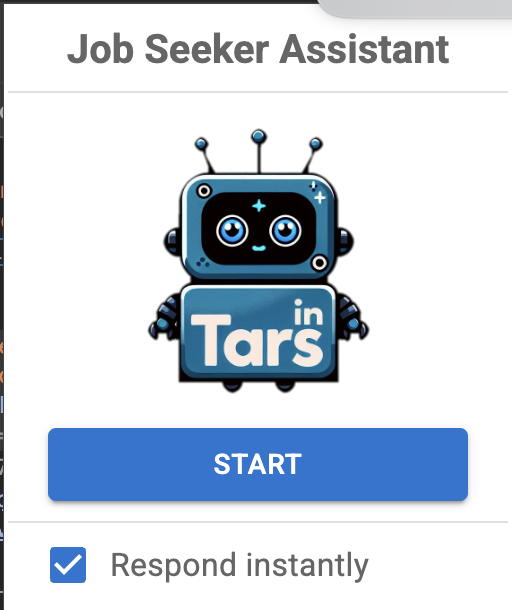
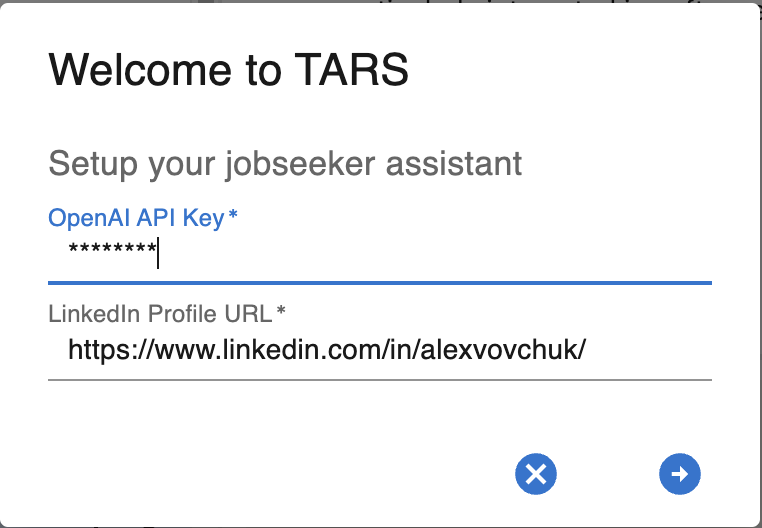
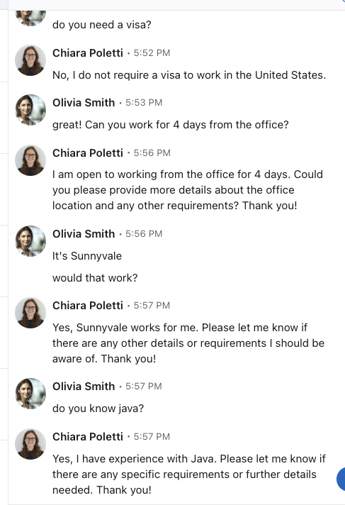

# Tars (Job Seeker Assistant)

**Tars** is an intelligent career assistant that automates job search tasks, manages professional communications, and proactively helps jobseekers secure their next opportunity while adapting to their unique career goals and preferences.

  

---

## ✨ Why Tars?

- ⚡ **Automate the tedious stuff**: Say goodbye to repetitive typing and hello to intelligent, dynamic responses.
- 🤖 **Smart interactions**: Tars adapts to missing information, asks clarifying questions, and generates professional responses.
- 🎯 **Tailored to you**: Customize how you respond for specific employers, ensuring you're always putting your best foot forward.
- 📊 **Clear summaries**: Get a concise overview of the interaction, so you're always in control.

---

## ✨ Vision

Imagine a world where within hours of raising your hand for your next job opportunity, you have 4 interviews scheduled.

Tars is pioneering a new era of professional networking, where every jobseeker's assistant understands their career aspirations and works for them around the clock. We're not just building another automation tool--we're creating an intelligent companion that learns from personal interactions, grows alongside your career, and accurately represents you as a professional. We are bridging the gap between automation and authentic human interaction.

Tars embodies LinkedIn's vision to create economic opportunity for people everywhere. Tars allows our members to delegate the administrative tasks that Jobseekers don't like doing (managing their inbox, replying to the same application questions) and allow them to focus on finding the right roles while connecting to hirers. As the professional world evolves, Tars will expand to support every aspect of the career journey–from searching and applying for jobs, to connecting with other professionals–while always learning and adapting to better serve our members.

---

## 🚦 How Does It Work?

### **1. Start Tars**

- Open a **LinkedIn messaging thread** with a hiring assistant.
- Click the **Tars** icon in your Chrome toolbar to activate the bot.

### **2. Provide Your Setup Details**

  

Tars will ask you for:

- **Your LinkedIn Profile URL**: To gather key candidate information.
- **API Key**: For secure and personalized data handling.
- **Initial Questions**: Specify any predefined responses or details you'd like Tars to emphasize.
- **Additional Information**: Fill in gaps that aren’t on your LinkedIn profile (e.g., preferred job locations, extra skills, or unique experiences).

### **3. Automated Magic**

  

- Tars detects screening questions in the chat and generates **tailored responses** in real-time.
- If Tars needs more details to provide an accurate response, it will prompt you for clarification.

### **4. Employer-Specific Handling**

- Define employers or job types that need unique responses. Tars ensures your answers are aligned with their expectations.

### **5. Summarization**

- At the end of the interaction, Tars provides a **summary** of all questions and responses, keeping you informed and prepared.

---

## Contribution

#### Node.js

Ensure you have the latest Node.js installed: [Node.js Official Website](https://nodejs.org/).

> **Note:** Sometimes, running `node -v` might show version 22 (latest), but an older version could still be in use under the hood.  
> If you encounter build errors, verify your Node.js versions with `volta list node`.  
> If the versions differ, update Node.js as required (e.g., using `nvm use 22`).

#### IDE

While using **VS Code** is optional, it is highly recommended.

**Suggested Extensions:**

- **ESLint**
- **Prettier**

---

#### Starting the Project

- **git clone**
- **npm install**
- **npm run build**
- In Google Chrome go to **chrome://extensions/** -> click **Load unpacked** -> select **dist** folder in extension
- In chrome extensions Pin **Tars**. Then click on it in top panel
